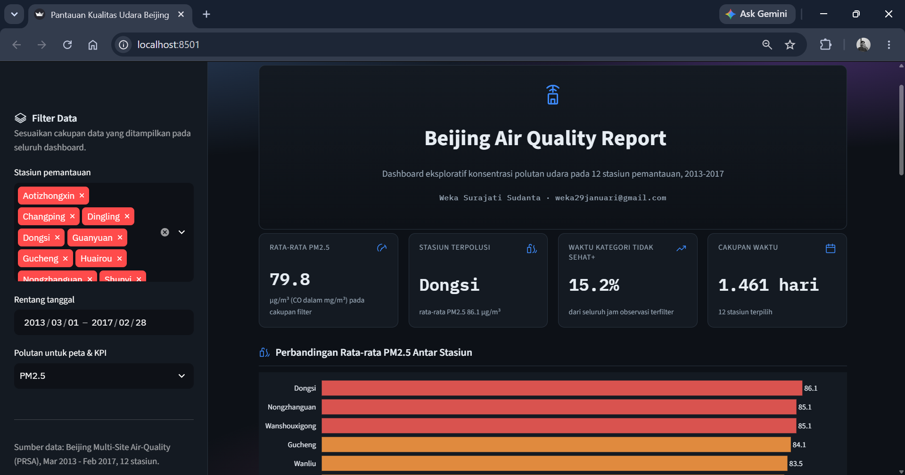

# Beijing Air Quality Dashboard 

## Preview

## Deskripsi
Dashboard interaktif untuk eksplorasi kualitas udara pada 12 stasiun pemantauan di Beijing (Air Quality Dataset / PRSA), periode Maret 2013 - Februari 2017. Dibuat sebagai submission akhir kelas Belajar Fundamental Analisis Data (Dicoding).

## Live Dashboard
https://beijing-air-quality-reporting.streamlit.app/

## Setup Environment - Anaconda

conda create --name main-ds python=3.9
conda activate main-ds
pip install -r requirements.txt

## Setup Environment - Shell/Terminal

mkdir beijing_air_quality_dashboard
cd beijing_air_quality_dashboard
pipenv install
pipenv shell
pip install -r requirements.txt

## Run Streamlit App

cd dashboard
streamlit run dashboard.py

## Sumber Data
Beijing Multi-Site Air-Quality Data Set (PRSA) — diakses melalui tautan dataset resmi submission Dicoding.